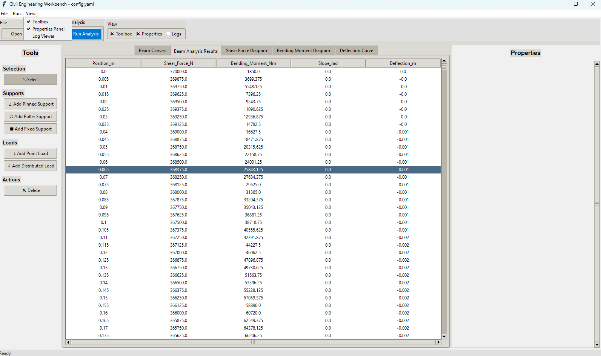
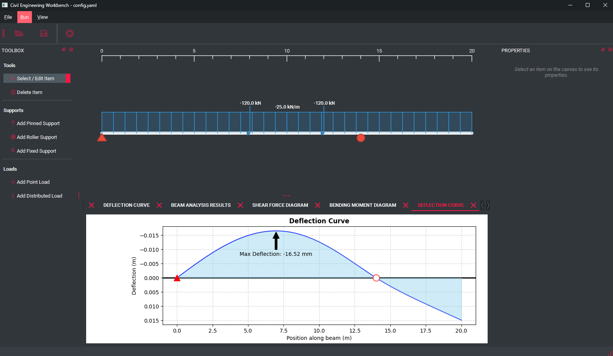

# Python Civil Engineering Workbench

This project is a command-line and GUI tool for performing structural analysis of beams, a common task in civil and structural engineering.

## Project Goal

The application allows users to define a beam's properties, its supports, and the loads applied to it via a `config.yaml` file. It then calculates and visualizes the resulting Shear Force Diagram (SFD) and Bending Moment Diagram (BMD).

## Project Structure

- `config.yaml`: The central configuration file where you define the beam, supports, and loads for analysis.
- `output/`: Directory for generated plots and reports (e.g., SFD/BMD images, results CSV).
- `src/`: Contains the main source code.
  - `civil/`: Core modules for performing the structural engineering calculations.
  - `gui/`: Modules for the PyQt6 graphical user interface.
  - `visualization/`: Modules for creating plots.
  - `main.py`: The main entry point for the analysis pipeline.
- `tests/`: Contains unit tests for the project.
- `requirements.txt`: Lists the Python dependencies.
- `run_cli.py`: Entry point to run the application from the command line.
- `run_gui.py`: Entry point to launch the GUI.

  
  
